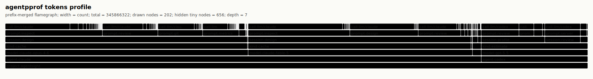
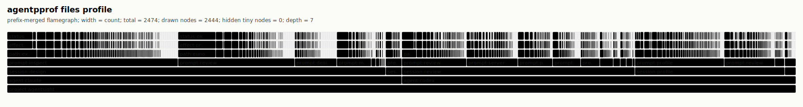
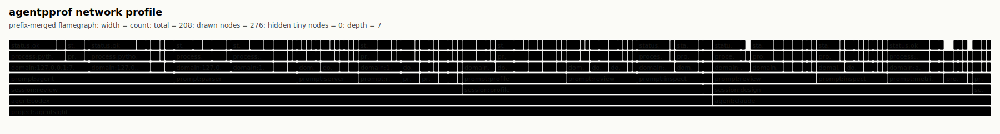

# Agent Flamegraphs

`agentpprof` turns local Codex and Claude Code sessions into pprof-style
semantic profiles. The SVG output is a prefix-merged flamegraph: shared stack
prefixes are drawn once, and each frame width is the inclusive weight below
that frame.

For the complete tool guide, release contract, and tagging model, see
[docs/agentpprof.md](../agentpprof.md).

Read the SVG from bottom to top. The lower frames are broader context such as
`project`, `agent`, `session`, and `prompt`; upper frames are more specific
activity such as LLM calls, tools, processes, file effects, network domains,
and status.

## Views

| View | Width means | Use it to answer | Stack shape |
| --- | ---: | --- | --- |
| `tokens` | Token count (input/output/cache) | Which prompts consumed the most model budget? | `project -> agent -> session -> prompt -> call -> model -> kind` |
| `time` | Duration in seconds | How long did each prompt/activity take? | `project -> agent -> session -> prompt -> kind` |
| `files` | File/path effect count | Which prompts touched which path groups? | `project -> agent -> session -> prompt -> path -> effect -> status` |
| `network` | Network/domain effect count | Which prompts contacted which domains? | `project -> agent -> session -> prompt -> domain -> process... -> status` |

Start with `tokens` to find cost hotspots. Use `time` to see where wall-clock
time went. Use `files` and `network` for security audits.

## Example Gallery

These checked-in images were generated from real local Codex/Claude sessions
for AgentSight with regex tags and redacted outputs. The committed files are
only SVG and folded-stack projections; they do not include raw session logs,
prompt previews, command previews, home paths, or secrets. Repo-external local
paths are grouped as `external/home`, `external/tmp`, `external/codex`,
`external/claude`, or `external/path`; private domains that include the local
username are grouped as `private.domain`.

### Tokens



### Time


### Files



### Network



## Output Formats

The output extension selects the common format when `--format` is not provided:

```bash
agentpprof -o tokens.svg --view tokens     # prefix-merged SVG flamegraph
agentpprof -o time.folded --view time      # folded stacks for inferno/flamegraph.pl
agentpprof -o tokens.pb.gz --view tokens   # Go pprof protobuf
agentpprof -o files.json --view files      # redacted session summary plus stack table
```

Open pprof output with standard Go tooling:

```bash
go tool pprof -top tokens.pb.gz
go tool pprof -http=:0 tokens.pb.gz
```

Folded stacks are plain text:

```text
project:agentsight;agent:claude;session:profile;prompt:debug;call:llm/debug;model:claude-opus-4-6;kind:cache 150000
```

## Tagging

Flamegraphs require semantic tags to aggregate meaningfully. Without rules,
prompts are marked `unmatched` and diagnostics guide you to add rules.

### Iterative Workflow

1. Run without rules to see diagnostics:
   ```bash
   agentpprof --project-root . -o out.json --format json --include-previews
   ```

2. Check `tagging.unmatched_samples` in the JSON output for patterns

3. Add `--tag-rule` arguments based on the patterns:
   ```bash
   agentpprof --project-root . -o out.svg \
     --tag-rule prompt:review='(?i)review|diff|pr' \
     --tag-rule prompt:debug='(?i)fix|bug|error'
   ```

4. Iterate until `tagging.coverage_pct` is acceptable

### Rule Syntax

```text
KIND:TAG=REGEX
```

- `KIND`: `session`, `prompt`, `llm`, or `all`
- `TAG`: lowercase word, 3-12 letters, semantic (avoid vague tags like `task`, `misc`, `work`)
- `REGEX`: pattern (use `(?i)` for case-insensitive)

Rules are evaluated in command-line order; first match wins.
Vague tags (task, work, misc, thing, stuff, other) produce a warning — use specific semantic tags.

### Built-in Preset

`--preset` enables generic keyword rules (profile, debug, test, review, etc.)
for quick testing. These are unlikely to match your project well and should
not be used for production flamegraphs.

### LLM Tagger

For model-produced tags, run a llama.cpp-compatible server:

```bash
llama-server -m /path/to/model.gguf --port 8080
agentpprof -o tokens.svg --tagger llm --llama-url http://127.0.0.1:8080
```

`--tag-rule` is only supported with `--tagger regex`.

### Example

See `examples/bpf-benchmark.sh` for a complete script with 100% coverage.

## Local History

Without `--session-file`, `agentpprof` scans recent local Codex and Claude Code
sessions that match `--project-root`:

```bash
agentpprof --project-root /path/to/repo --view tokens -o tokens.svg
```

Local histories can contain prompts, paths, tool outputs, and model responses.
Use explicit `--session-file` inputs for controlled private investigations.
JSON output redacts previews by default; only pass `--include-previews` for
private debugging or already-sanitized sessions.

Useful selectors:

```bash
agentpprof -o tokens.svg --agent codex
agentpprof -o tokens.svg --session-id 019ec5
agentpprof -o tokens.svg --session-tag profile
agentpprof -o tokens.svg --prompt-tag review
```

## Regenerating Local Views

Regenerate views from your own local history:

```bash
for view in tokens time files network; do
  agentpprof \
    --project-root /path/to/repo \
    --tagger regex \
    --view "$view" \
    -o "${view}.svg"
done
```

For private, fixed-input analysis, pass one or more explicit session files:

```bash
agentpprof \
  --session-file ~/.codex/sessions/.../session.jsonl \
  --tagger regex \
  --view tokens \
  -o tokens.folded
```
